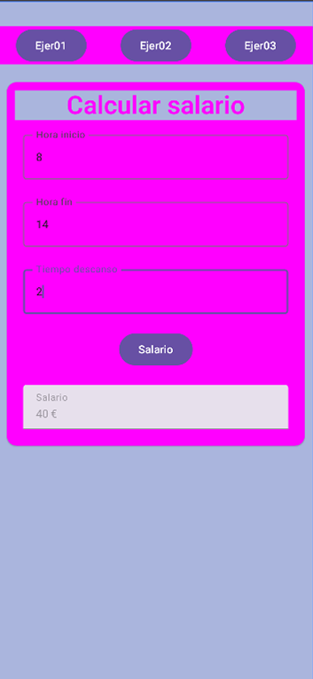
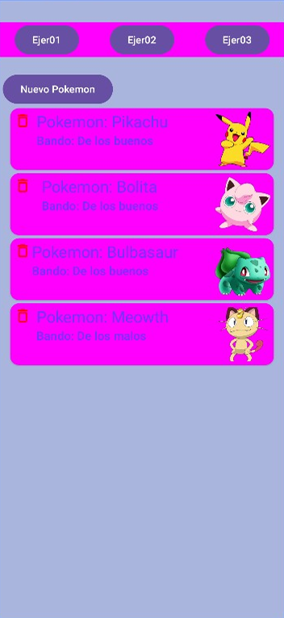
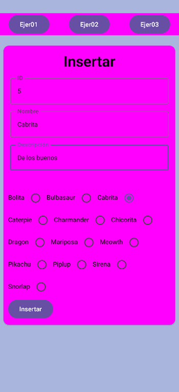

# Android Exam Project – Jetpack Compose

This project was developed as part of a technical assessment during my training in application development. It is a mobile application built with **Android Studio** and **Jetpack Compose**, following the structure and requirements outlined in the official exam.

The application demonstrates modern UI design, effective navigation between screens, dynamic content handling, and user interaction — all implemented using the declarative approach of Jetpack Compose.

## 🛠️ Tech Stack

- **Kotlin**
- **Jetpack Compose**
- **Android Studio**

## 📁 Project Structure

The app follows a modular and readable structure to separate concerns and ensure maintainability. The source code is available in the `src/` directory.

## 📸 Screenshots

  
  
  

## 📌 Notes

This project is a personal version of the exam solution and reflects my skills in UI development, logic implementation, and clean code practices.
